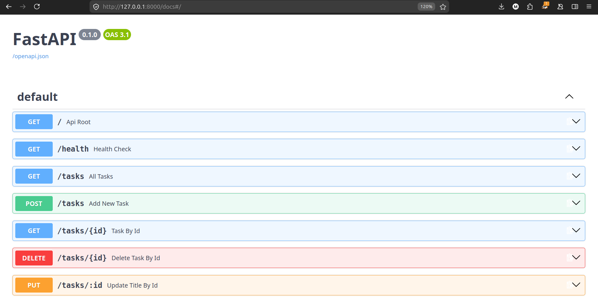
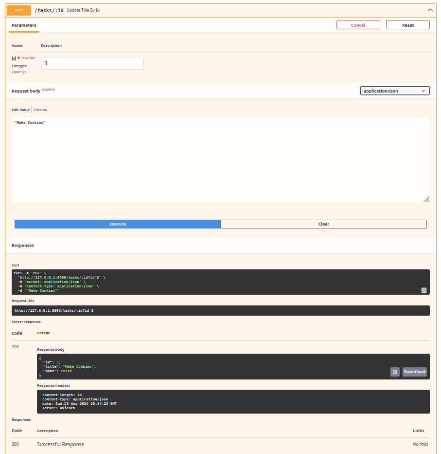
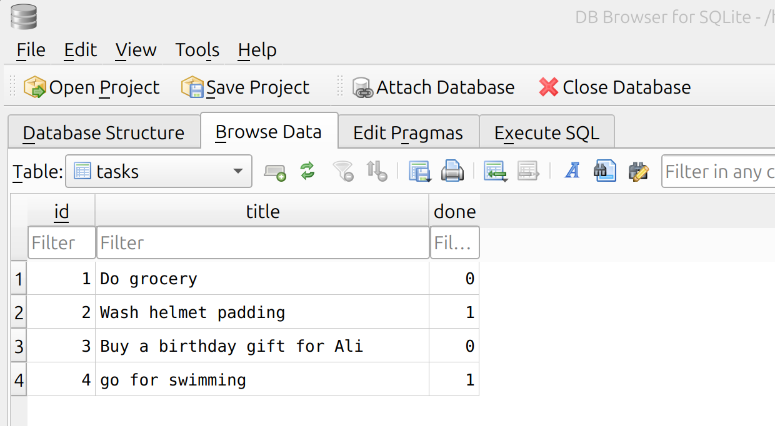

# Task Management CRUD API


A lightweight RESTful API for managing a to-do list, built with **FastAPI, SQLAlchemy, and SQLite**.

This project started as an in-memory CRUD API during Assignment 1 and was extended for Assignment 2 to use a real SQLite database. Tasks are now stored in `tasks.db`, so they persist even after the server is restarted.

## Quick Start

Clone the repository, install the required dependencies, and start the API with:

```bash
uvicorn main:app --reload
```

The server will be available at:

```text
http://localhost:8000
```

The SQLite database is created automatically when the application starts. No separate database server or manual database setup is required.

---

## Why SQLite?

SQLite was chosen because it is simple and lightweight for a small API like this.

- The database is stored in a single file.
- No separate database server is required.
- The database is created automatically.
- Data persists when the API is restarted.
- The database can be easily inspected using DB Browser for SQLite.

The database file is:

```text
tasks.db
```

It is created automatically in the project directory when the application first runs.

---

## Why SQLAlchemy ORM?

SQLAlchemy's ORM allows the API to work with database tables through Python classes and objects instead of writing raw SQL for every operation.

For this project, it makes database operations easier to organize and maintain while keeping the application code readable. It also provides a clean layer between the FastAPI endpoints and the database, and the same ORM approach can be used with larger databases such as PostgreSQL or MySQL with minimal changes to the application logic.

For example, instead of writing a raw SQL query:

```sql
SELECT * FROM tasks WHERE id = 1;
```

the API can query the database using the `Tasks` model:

```python
db.query(Tasks).filter(Tasks.id == 1).first()
```

This project uses SQLAlchemy ORM for all CRUD operations.

## API Reference

| HTTP Method | Endpoint | Description | Expected Status Codes |
| --- | --- | --- | --- |
| **GET** | `/` | Returns API metadata. | `200 OK` |
| **GET** | `/health` | Returns the API health status. | `200 OK` |
| **GET** | `/tasks` | Retrieves all tasks. | `200 OK` |
| **GET** | `/tasks/{id}` | Retrieves a single task by ID. | `200 OK`, `404 Not Found` |
| **POST** | `/tasks` | Creates a new task. | `201 Created`, `400 Bad Request` |
| **PUT** | `/tasks/{id}` | Updates an existing task. | `200 OK`, `400 Bad Request`, `404 Not Found` |
| **DELETE** | `/tasks/{id}` | Deletes a task. | `204 No Content`, `404 Not Found` |

---

## Database

The API uses **SQLAlchemy** to interact with the SQLite database.

The `tasks` table contains:

| Column | Type | Description |
| --- | --- | --- |
| `id` | Integer | Automatically generated primary key |
| `title` | String | Task title |
| `done` | Boolean | Whether the task is completed |

When the database is empty, the application automatically inserts three sample tasks. This only happens when the table contains zero rows, so restarting the application does not create duplicate seed data.

---

## Testing the API

### Example `curl` Request

```bash
curl -i http://localhost:8000/tasks
```

Example response:

```json
[
    {
        "id": 1,
        "title": "Do grocery",
        "done": false
    },
    {
        "id": 2,
        "title": "Wash helmet padding",
        "done": true
    },
    {
        "id": 3,
        "title": "Buy a birthday gift for Ali",
        "done": false
    }
]
```

You can also test the complete CRUD cycle through FastAPI's automatically generated Swagger UI.

---

## Interactive Documentation

FastAPI automatically generates interactive API documentation.

Open the following URL after starting the server:

```text
http://localhost:8000/docs
```

From Swagger UI, you can test all of the available endpoints directly from your browser.

### Screenshots





---

## DB Browser for SQLite

The database was also explored using **DB Browser for SQLite** to inspect the table and run SQL queries directly.

For example:

```sql
SELECT * FROM tasks WHERE done = 1;
```

This query returns all tasks where `done` is `1`, meaning the task has been marked as completed.

### Database Screenshot



---

## Project Structure

```text
task-api-fastapi/
├── assets/
│   ├── img.png
│   ├── img_1.png
│   └── img_2.png
├── main.py
├── tasks.db
├── .gitignore
└── README.md
```

> `tasks.db` is created automatically by the application and hence was excluded from Git so that each clone can create its own fresh database.

---

## What Changed From the Previous Version?

Version 1 stored tasks in memory, meaning all data was lost whenever the application stopped.

Version 2 replaces that in-memory storage with SQLite:

```text
Version 1:
Client → FastAPI → In-memory data

Version 2:
Client → FastAPI → SQLAlchemy → SQLite
```

The API endpoints remain the same, but the data now survives application restarts.